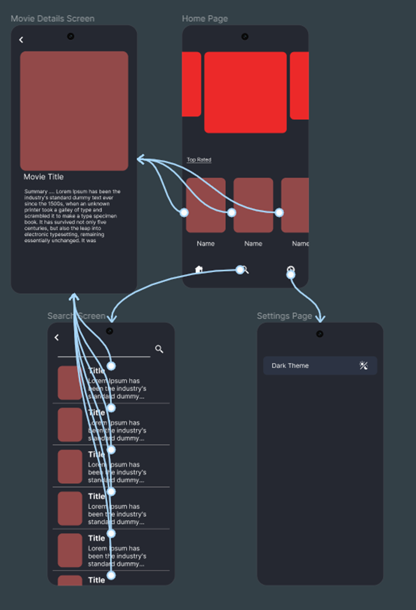
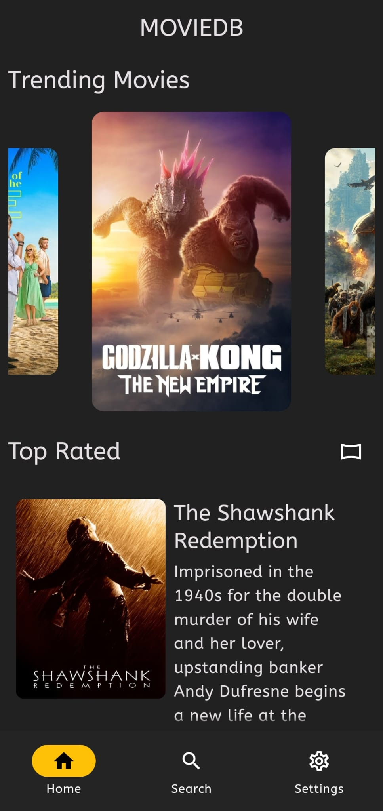
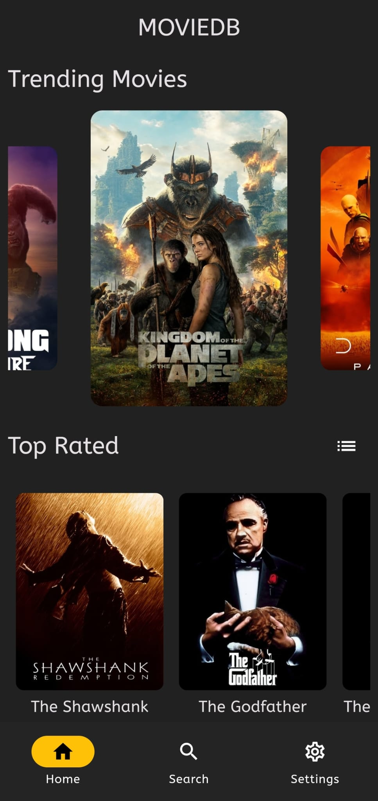
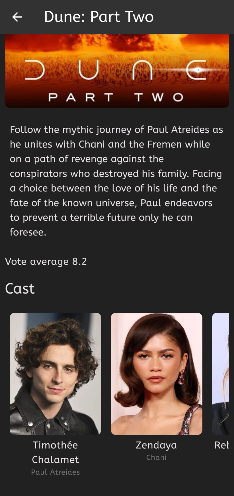
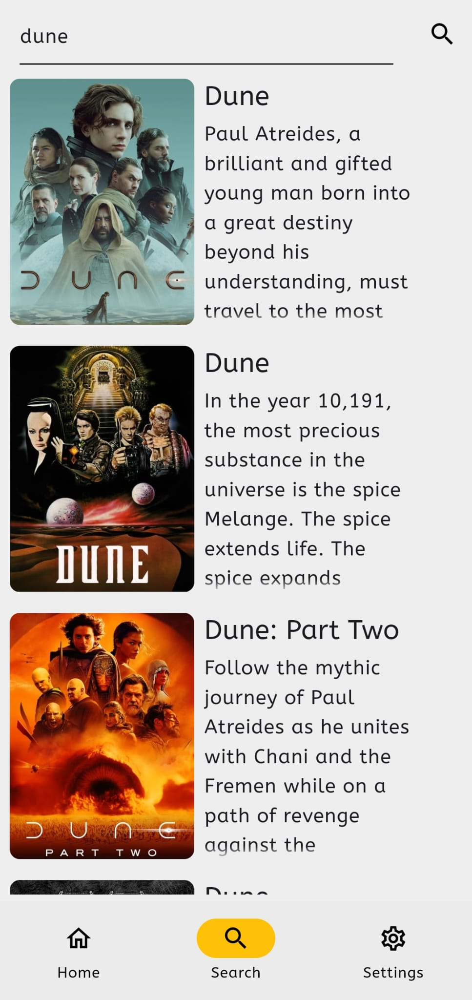
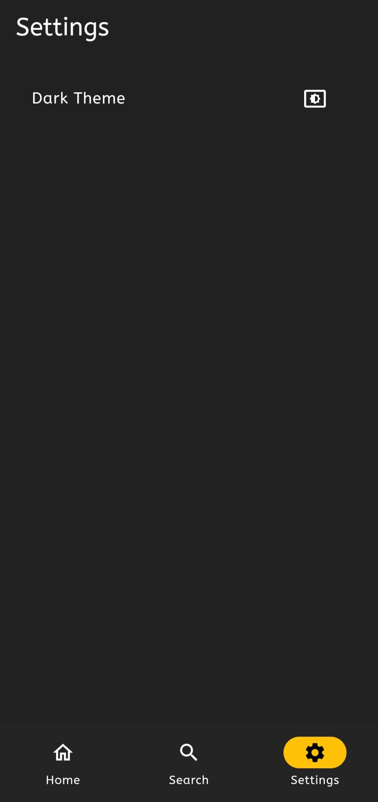

# Movie DB App

A cross-platform mobile app for discovering movies — browse trending films, search by title, actor, or director, view full cast and ratings, and build a personal watchlist.

**Assignment:** Cross Platform Development  
**Student:** Anas Syed  
**Student ID:** G20967160

---

## Features

- Browse trending movies and latest releases
- Search by title, actor, director, or production company
- Advanced filters — genre, year, rating, popularity
- Full movie details: cast, crew, ratings, high-quality posters
- User ratings alongside professional critic and community scores
- Personalised movie suggestions
- Watchlist with bookmarking
- Offline support via local caching

---

## Tech Stack

| | |
|---|---|
| **Framework** | Flutter / Dart |
| **Data** | TMDB REST API |
| **State Management** | Flutter state management |
| **Storage** | Local caching for offline use |
| **Performance** | Lazy loading + image caching |

---

## Getting Started

### Prerequisites

- Flutter SDK 3.x — [install guide](https://docs.flutter.dev/get-started/install)
- A TMDB API key — free at [themoviedb.org/settings/api](https://www.themoviedb.org/settings/api)

### Setup

```bash
git clone https://github.com/anasyd/movie_app.git
cd movie_app
flutter pub get
```

Create a `.env` file in the project root:

```env
TMDB_API_KEY=your_api_key_here
```

### Run

```bash
# iOS
flutter run -d ios

# Android
flutter run -d android
```

---

## Screenshots

| | |
|:---:|:---:|
| **Wireframe (Figma)** | **Home Screen** |
|  |  |
| **Home Screen (Horizontal Layout)** | **Movie Details** |
|  |  |
| **Search** | **Settings** |
|  |  |
