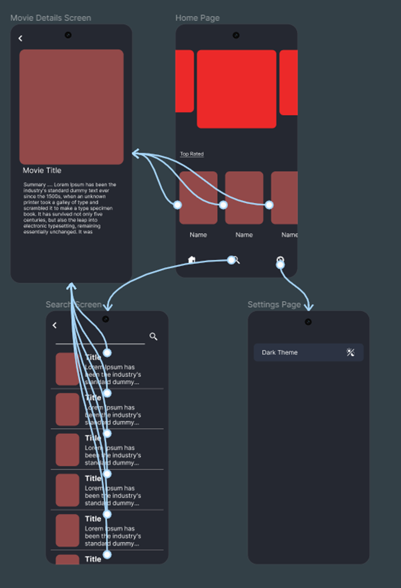
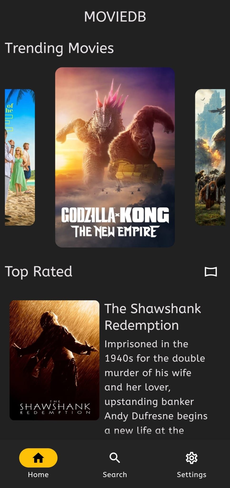
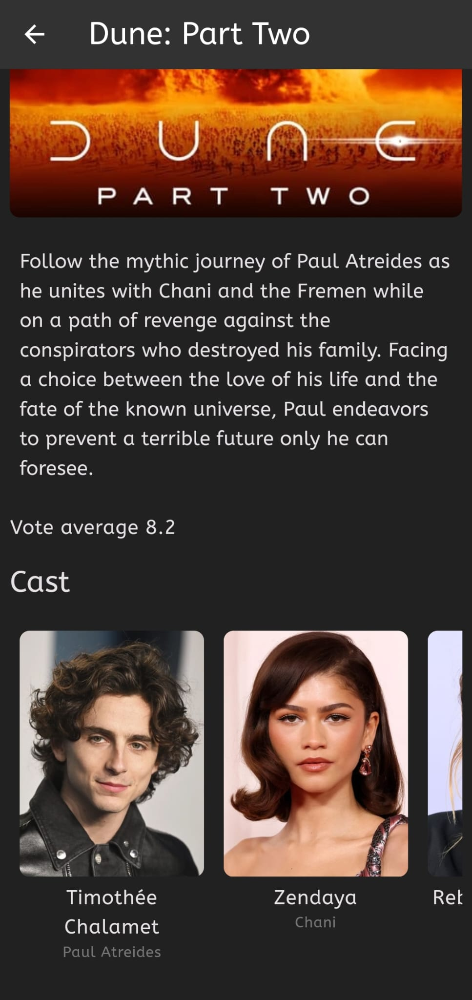

# movie_app
# Cross Platform Assignment
by
## Anas Syed
## G20967160

### Wireframing in Figma

### Home Screen with different layout options

### Movie Details Screen

### Search Screen

### Setting Screen to change to themes

